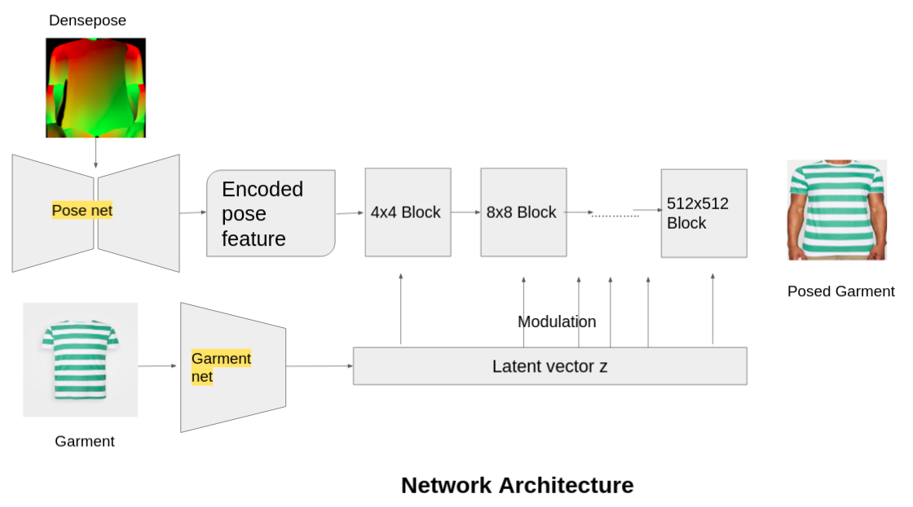

# Densepose based virtual try on using Generative Adversarial Network

The goal of this project is to accomplish virtual try on from a single RGB image and target cloth

# Network architecture and pipeline:
We have extracted densepose given a RGB image using official [Densepose repo](https://github.com/facebookresearch/detectron2/tree/main/projects/DensePose)

The input to our pipeline is densepose IUV map and the target RGB cloth image as shown in the below figure. The network architecture is motivated from [StylePoseGAN](https://vcai.mpi-inf.mpg.de/projects/Styleposegan/) and [StyleGAN2](http://arxiv.org/abs/1912.04958)

# Dataset
- Test1: We collected 10000 pair images of cloth and person on that cloth from internet. 

- Test2: We collected 100 pair images of same cloth with different person in very hard poses of soccer.

# Result
Below are the generated images followed by real images for Test1:
#### Real images

#### Fake images

Below are the generated images followed by real images for Test2:
#### Real images

#### Fake images

# Training and Testing:
The codebase is developed on top of official [StyleGAN2-ADA](https://github.com/NVlabs/stylegan2-ada-pytorch). Kindly follow the similar steps for training and testing.

# Checkpoint
- model weights for test1 can be downloaded [here](https://drive.google.com/drive/folders/1g8-1ZR_e3lLUx2NpS4xZo1jdLDHup_R7?usp=sharing)
- model weights for test2 can be downloaded [here](https://drive.google.com/drive/folders/1g8-1ZR_e3lLUx2NpS4xZo1jdLDHup_R7?usp=sharing)

